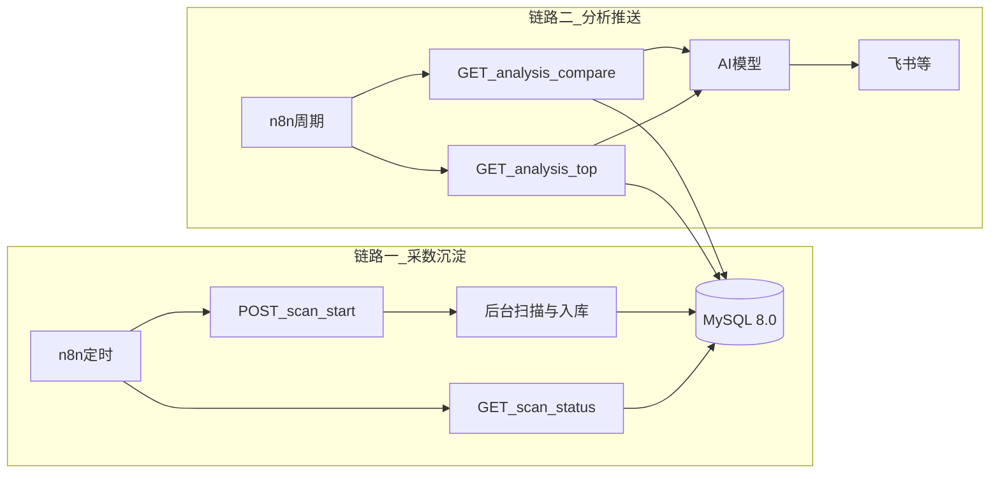

# ASO 蓝海关键词分析服务

将本地 ASO 扫描脚本服务化：FastAPI 提供 HTTP 接口、**MySQL 8.0** 持久化、API 密钥鉴权，支持 Docker 一键部署与 n8n 定时调用。

**数据存储与访问（一并说明，避免误解）**：

- **SQL 服务端**：统一使用 **MySQL 8.0**（`docker-compose` 中镜像为 `mysql:8.0`）。本项目不以 SQLite / 其他方言为目标环境，分析 SQL（如窗口函数 `LAG`）按 MySQL 8.0 语法编写与测试。
- **Python 访问层**：使用 **`pymysql`** 建立连接并执行 **手写、参数化** 的 SQL（见 `aso-service/app/database.py`），**不使用 ORM**（无 SQLAlchemy 等）。`pymysql` 是 **客户端驱动**，不是第二套数据库；不存在「从 pymysql 迁到 MySQL 8.0」的迁移——二者是 **引擎 + 驱动** 的组合关系。

核心业务逻辑在仓库根目录的 **`aso_core`** 包中；`aso-service/app/` 负责 HTTP、鉴权、**MySQL 8.0 建表与读写**。

## 核心业务链路

自动化场景中，本服务承担 **「采数入库」** 与 **「供数给 AI」** 两段能力；n8n 负责调度与串联下游（大模型、飞书等）。

### 链路一：n8n 定时触发检索，数据沉淀到 MySQL

1. n8n **Schedule** 到点触发。
2. 调用 **`POST /scan/start`**（带 `X-API-Key`），服务**立即**返回 `batch_id`，扫描在**后台线程**中执行（耗时可达数十分钟，勿让 n8n 单节点同步死等）。
3. 后台执行：`aso_core` 多国家扫描 → 蓝海评分 → **`aso_keywords` 批量写入 MySQL 8.0**，**`aso_scan_jobs`** 更新为 `done` / `failed`（`full` 模式下写库后可能执行种子进化，见 **`app/evolution.py`**）。
4. n8n 使用 **Wait + 轮询 `GET /scan/status/{batch_id}`**，直到 `status` 为 `done` 或 `failed`；失败时读 `error_msg` 告警。

### 链路二：n8n 周期拉取分析接口 → AI → 飞书等

1. n8n **Schedule**（建议与全量扫描错开，例如次日早间）。
2. 调用 **`GET /analysis/compare`**（推荐，带本期/基线窗口与 `rising` / `new_entries` 等分类）或 **`GET /analysis/top`**（简单 Top 列表，按 `label` / `days` / `limit` 过滤）。
3. 将响应中的结构化数据传入 **AI 节点**（Claude / GPT 等），按业务 Prompt 生成对比解读或机会清单。
4. 将 AI 输出通过 **飞书机器人 Webhook**、企业微信、邮件等节点推送给业务方。

**报告类**大模型解读与飞书推送由 **n8n** 配置；**全量扫描**结束后，服务内 **`app/evolution.py`** 可按配置调用 Anthropic 生成待校验种子（需 `ANTHROPIC_API_KEY`，与 n8n 所用 AI 密钥相互独立）。详见下文「技术约束」。



## 部署命令

构建上下文为**仓库根目录**（以便打包 `aso_core` 与 `app`）。请在 **`aso-service`** 目录下执行：

```bash
cd aso-service
cp .env.example .env
# 编辑 .env 填入密码和 API_KEY
docker compose up -d --build

# 查看启动日志
docker compose logs -f aso-service
```

依赖统一维护在仓库根目录 [`requirements.txt`](../requirements.txt)，镜像构建时从根目录复制该文件。

Compose 中数据库服务使用官方 **`mysql:8.0`** 镜像；应用进程通过 **`pymysql`** 连接该实例并执行手写 SQL。

## 手动触发一次扫描（测试用）

```bash
curl -X POST http://localhost:8000/scan/start \
  -H "X-API-Key: 你的API_KEY" \
  -H "Content-Type: application/json" \
  -d '{"mode": "full"}'
```

指定扫描国家（可选，**最多 5 个** ISO 3166-1 alpha-2 **小写**；不传则使用环境变量 **`ASO_SCAN_COUNTRIES`**）：

```bash
curl -X POST http://localhost:8000/scan/start \
  -H "X-API-Key: 你的API_KEY" \
  -H "Content-Type: application/json" \
  -d '{"countries": ["us", "gb"], "mode": "full"}'
```

每日追踪模式：对 **`aso_seeds` 中 `status=active`**、且在 **近 30 天**内曾在 `aso_keywords` 中出现 **`blue_ocean_score >= 60`** 的种子，按与全量相同的「种子 → Autocomplete 展开」流程刷新（国家列表规则与 `full` 相同）。

```bash
curl -X POST http://localhost:8000/scan/start \
  -H "X-API-Key: 你的API_KEY" \
  -H "Content-Type: application/json" \
  -d '{"mode": "tracking"}'
```

## 查询任务状态

```bash
curl http://localhost:8000/scan/status/{batch_id} \
  -H "X-API-Key: 你的API_KEY"
```

## 拉取分析结果（Top 列表）

```bash
curl "http://localhost:8000/analysis/top?label=💎%20金矿&limit=20&days=7&countries=us,gb" \
  -H "X-API-Key: 你的API_KEY"
```

`countries` 为可选 Query：逗号分隔 alpha-2 小写；不传则**不按国家过滤**。

## 对比分析（本期 vs 基线）

```bash
curl "http://localhost:8000/analysis/compare?days_recent=7&days_baseline=14" \
  -H "X-API-Key: 你的API_KEY"
```

说明：`label` 含空格或 emoji 时请对 URL 进行编码（如上例中的 `%20`）。

## 接口调用文档

### 通用约定

| 项 | 说明 |
|----|------|
| Base URL | 内网示例 `http://aso-service:8000`；本机调试 `http://localhost:8000` |
| 鉴权 | 除 **`GET /health`** 外，均需在请求头携带 **`X-API-Key`**，值为 `.env` 中 **`API_KEY`** |
| 内容类型 | `POST /scan/start` 使用 **`Content-Type: application/json`** |
| 认证失败 | HTTP **401**，响应体示例：`{"detail":"Invalid API Key"}`（缺失密钥同样视为无效） |

### 接口一览

| 方法 | 路径 | 鉴权 | 说明 |
|------|------|------|------|
| GET | `/health` | 否 | 健康检查（Docker / 负载均衡探活） |
| POST | `/scan/start` | 是 | 异步启动扫描（`mode=full` 全量 / `tracking` 追踪种子）；立即返回 `batch_id` |
| GET | `/scan/status/{batch_id}` | 是 | 查询扫描任务状态与关键词条数 |
| GET | `/analysis/top` | 是 | 按时间窗口、可选国家、可选标签从 **MySQL 8.0** 拉取 Top 关键词 |
| GET | `/analysis/compare` | 是 | 本期与基线窗口对比，返回 `rising` / `new_entries` / `sustained` / `dropping` |
| GET | `/seeds/status` | 是 | 种子矩阵与进化日志快照（`aso_seeds` / `aso_seed_evolution_log`） |

**排名历史文件**：`rank_history.json` 路径由环境变量 **`RANK_HISTORY_PATH`** 指定（Compose 示例：`/data/rank_history.json`），挂载到 **`aso-data`** 卷，容器重启后不丢失。

---

### GET `/health`

用于探活，**无需** `X-API-Key`。

**响应示例（200）**

```json
{"status": "ok"}
```

---

### POST `/scan/start`

启动一次关键词扫描（后台执行）：**全量**（`aso_seeds` 中 `active` 种子矩阵）或 **tracking**（符合条件的 active 种子再展开）。

**请求头**

- `X-API-Key: <API_KEY>`
- `Content-Type: application/json`

**请求体（JSON）**

| 字段 | 类型 | 必填 | 说明 |
|------|------|------|------|
| `countries` | string[] | 否 | 扫描国家列表，每项为 **ISO 3166-1 alpha-2 小写**，**最多 5 个**；不传则使用环境变量 **`ASO_SCAN_COUNTRIES`**；传空数组 `[]` 等价于不传 |
| `mode` | string | 否 | `"full"`（默认）= 从库读 active 种子做矩阵扫描，写库后执行种子进化（`evolution`）；`"tracking"` = 仅对 **近 30 天**内在 `aso_keywords` 中曾出现 **`blue_ocean_score >= 60`** 的 **active 种子** 做与全量相同的展开扫描 |

`tracking` 依赖历史入库数据；若无任何符合条件的种子，任务立即 `done` 且 `total_keywords=0`。

**校验失败**：`countries` 非法或超过 5 个时返回 **HTTP 400**。

示例：

```json
{"mode": "full"}
```

```json
{"countries": ["us", "gb"], "mode": "full"}
```

```json
{"mode": "tracking"}
```

**响应示例（200）**

```json
{
  "batch_id": "550e8400-e29b-41d4-a716-446655440000",
  "status": "started",
  "mode": "full",
  "countries": null,
  "message": "扫描任务已启动，使用 batch_id 查询进度"
}
```

`countries` 为本次请求解析后的列表；未指定时为 `null`（后台使用 **`ASO_SCAN_COUNTRIES`**）。

---

### GET `/scan/status/{batch_id}`

根据 `batch_id` 查询任务是否结束及写入条数。

**请求头**

- `X-API-Key: <API_KEY>`

**路径参数**

- `batch_id`：`POST /scan/start` 返回的 UUID 字符串。

**响应示例（200）**

```json
{
  "batch_id": "550e8400-e29b-41d4-a716-446655440000",
  "status": "done",
  "total_keywords": 238,
  "created_at": "2026-04-10 02:00:00",
  "finished_at": "2026-04-10 02:45:00",
  "error_msg": null
}
```

`status` 取值：`running` | `done` | `failed`。失败时 `error_msg` 为非空字符串。

**错误**

- **404**：`batch_id` 不存在（响应体为 FastAPI 默认 `detail` 结构）。

---

### GET `/analysis/top`

从 **MySQL 8.0** 读取最近一段时间内的关键词记录，按 **`blue_ocean_score` 降序**，供 n8n 与 AI 消费。

**请求头**

- `X-API-Key: <API_KEY>`

**Query 参数**

| 参数 | 类型 | 必填 | 默认 | 说明 |
|------|------|------|------|------|
| `label` | string | 否 | — | 与库中 **`blue_ocean_label`** 精确匹配，如 `💎 金矿`、`🟢 蓝海`；含空格或符号时请 **URL 编码** |
| `limit` | int | 否 | 50 | 返回条数上限，**最大 200**（超出会被截断为 200） |
| `days` | int | 否 | 7 | 只返回最近 `days` 天内 **`scanned_at`** 落在窗口内的数据 |
| `countries` | string | 否 | — | 逗号分隔 **alpha-2 小写**国家码，如 `us,gb`；只返回 **`country` 列**属于列表内的行；不传则**不按国家过滤** |

**响应示例（200）**

```json
{
  "generated_at": "2026-04-10 09:00:00",
  "total": 12,
  "keywords": [
    {
      "keyword": "track medication",
      "country": "us",
      "blue_ocean_score": 85,
      "blue_ocean_label": "💎 金矿",
      "blue_ocean_flags": "多路径触发 | 头部极弱",
      "top_reviews": 320,
      "concentration": 0.21,
      "avg_update_age_months": 18.0,
      "trend_gap": 4.1,
      "rank_change": 3,
      "scanned_at": "2026-04-10 02:45:00"
    }
  ]
}
```

**说明**：`top_reviews` 等字段可能为 `null`（视入库数据而定）；n8n 下游 AI 节点请对空值做容错。

---

### GET `/analysis/compare`

对比 **本期窗口** 与 **基线窗口** 内、每个关键词**各自最新一条**快照的蓝海分变化。`score_delta` 在 **MySQL 8.0** 中通过两期分数 **`UNION ALL` + `LAG(blue_ocean_score) OVER (PARTITION BY keyword ORDER BY phase)`** 得到（`phase=0` 基线，`phase=1` 本期）；实现见 `aso-service/app/database.py` 中 **`get_compare_analysis`** 的手写 SQL。

**说明**：当前 SQL 按 **`keyword` 分区**取最新快照，**未按 `country` 分列对比**；若同一关键词在多个国家均有入库，对比结果对应「该词在库中的最新一条记录」，多国细分需在后续版本中扩展 SQL。

**时间窗口定义**

- **本期**：`scanned_at >= NOW() - days_recent` 天。
- **基线**：`scanned_at >= NOW() - (days_recent + days_baseline)` 天 **且** `scanned_at < NOW() - days_recent` 天。

**请求头**

- `X-API-Key: <API_KEY>`

**Query 参数**

| 参数 | 类型 | 必填 | 默认 | 说明 |
|------|------|------|------|------|
| `days_recent` | int | 否 | 7 | 本期长度（天），范围 1–366 |
| `days_baseline` | int | 否 | 14 | 基线长度（天），范围 1–366 |

**响应示例（200）**

单条关键词对象字段与 **`GET /analysis/top`** 中 `keywords[]` 元素**基本一致**（对比接口当前响应**不含** `country` 字段，且按 `keyword` 聚合，见上文说明），并增加整数 **`score_delta`**：

- 基线无该词：`score_delta` = 本期 `blue_ocean_score`（归入 **`new_entries`**）。
- 两期均有：`score_delta` = 本期分 − 基线分；`>0` → **`rising`**，`<0` → **`dropping`**，`0` → **`sustained`**。

```json
{
  "generated_at": "2026-04-10 09:00:00",
  "days_recent": 7,
  "days_baseline": 14,
  "counts": {
    "rising": 3,
    "new_entries": 2,
    "sustained": 10,
    "dropping": 1
  },
  "rising": [],
  "new_entries": [],
  "sustained": [],
  "dropping": []
}
```

各数组内对象示例（与 `/analysis/top` 一致并含 `score_delta`）：

```json
{
  "keyword": "track medication",
  "blue_ocean_score": 85,
  "blue_ocean_label": "💎 金矿",
  "blue_ocean_flags": "多路径触发 | 头部极弱",
  "top_reviews": 320,
  "concentration": 0.21,
  "avg_update_age_months": 18.0,
  "trend_gap": 4.1,
  "rank_change": 3,
  "scanned_at": "2026-04-10 02:45:00",
  "score_delta": 5
}
```

## n8n Workflow 1：定时全量扫描（建议每周一 02:00）

**节点1 — Schedule Trigger**

- 每周一 02:00 触发

**节点2 — HTTP Request（触发扫描）**

- Method: POST
- URL: `http://aso-service:8000/scan/start`
- Headers: `X-API-Key` → `{{$env.ASO_API_KEY}}`
- Body (JSON): `{"mode": "full"}`（可选 `"countries": ["us","gb"]`，规则见上文 `POST /scan/start`）

**节点3 — Wait**

- 等待 90 分钟（扫描预留时间）

**节点4 — HTTP Request（确认完成）**

- Method: GET
- URL: `http://aso-service:8000/scan/status/{{$node["触发扫描"].json.batch_id}}`
- Headers: `X-API-Key` → `{{$env.ASO_API_KEY}}`

## n8n Workflow A：每日追踪扫描（建议每日 03:00）

用于在两次全量扫描之间**低成本刷新**：对 **近 30 天**内曾出现 **蓝海分≥60** 的 **active 种子** 再跑一轮「种子 → 补全展开」（国家列表与 `full` 相同，默认来自 **`ASO_SCAN_COUNTRIES`**）。

**节点1 — Schedule Trigger**

- 每日 03:00（按服务器时区）

**节点2 — HTTP Request（触发追踪扫描）**

- Method: POST
- URL: `http://aso-service:8000/scan/start`
- Headers: `X-API-Key` → `{{$env.ASO_API_KEY}}`
- Body (JSON): `{"mode": "tracking"}`

**节点3 — Wait**

- 等待 **15 分钟**（追踪词量远小于全量，一般足够；若超时可将节点4改为循环轮询直至 `done`）

**节点4 — HTTP Request（确认完成）**

- Method: GET
- URL: `http://aso-service:8000/scan/status/{{$node["触发追踪扫描"].json.batch_id}}`
- Headers: `X-API-Key` → `{{$env.ASO_API_KEY}}`

## n8n Workflow C：对比分析推送（建议每周二 09:00）

**节点1 — Schedule Trigger**

- 每周二 09:00 触发

**节点2 — HTTP Request（拉取对比数据）**

- Method: GET
- URL: `http://aso-service:8000/analysis/compare?days_recent=7&days_baseline=14`
- Headers: `X-API-Key` → `{{$env.ASO_API_KEY}}`

（若仅需静态 Top 列表、不做窗口对比，可仍使用 `GET /analysis/top`。）

**节点3 — AI 模型节点（Claude / GPT）**

System Prompt：

```
你是一位 App Store 市场分析师，擅长解读关键词蓝海分的变化与产品机会。
请用中文回答，结构清晰，善用标题与小节；涉及分数时请引用接口给出的 score_delta 与 blue_ocean_score。
```

User Prompt 模板（结构化对比版，数据源为 `/analysis/compare` 的 JSON）：

```
以下是 ASO 服务返回的「本期 vs 基线」对比结果（字段含义：rising=分数上升，new_entries=本期新出现，
sustained=两期同分，dropping=分数下滑；每条含 score_delta 与当前 blue_ocean_score）。

请按下面结构输出 Markdown：

## 1. 执行摘要
用 3～5 句话概括本周关键词池整体是变强、走平还是走弱。

## 2. 上升与新进（重点机会）
- 从 rising 与 new_entries 中各选最值得关注的共 3～5 个词
- 每个词：一句话机会判断 + score_delta 与当前分说明

## 3. 持续高分的护城河词
- 从 sustained 中选 2～4 个词，说明为何值得长期跟踪

## 4. 下滑与风险
- 从 dropping 中列出需警惕的词及可能原因（竞争加剧、补全排名变化等，可结合 flags）

## 5. 下周建议动作
- 产品侧 / 投放侧各 1～2 条可执行建议

原始数据（勿逐条照抄，用于推理）：
rising: {{$json.rising}}
new_entries: {{$json.new_entries}}
sustained: {{$json.sustained}}
dropping: {{$json.dropping}}
counts: {{$json.counts}}
```

**节点4 — 飞书 Webhook**

- Method: POST
- URL: 飞书机器人 Webhook 地址
- Body:

```json
{
  "msg_type": "text",
  "content": {
    "text": "📊 本周 ASO 蓝海分析报告\n\n{{$json.choices[0].message.content}}"
  }
}
```

## 本地开发（非 Docker）

在 **`aso-service`** 目录启动，将**仓库根目录**加入 `PYTHONPATH` 以加载 `aso_core`：

```bash
cd /path/to/aso_opportunities/aso-service
python -m venv .venv
source .venv/bin/activate
pip install -r ../requirements.txt
export PYTHONPATH=..
export $(grep -v '^#' .env | xargs)  # 或手动 export MySQL 等变量
uvicorn app.main:app --reload --host 0.0.0.0 --port 8000
```

需本地已安装 MySQL 8.0，并在 `.env` 中将 `MYSQL_HOST` 设为 `127.0.0.1`。

## 技术约束

- **SQL 服务**：统一 **MySQL 8.0**（部署与本地开发均以该版本为准；SQL 方言不面向其他数据库做兼容承诺）。
- **应用侧访问**：**`pymysql`** 直连、手写 SQL、**无 ORM**；表结构在 **`init_db()`** 中维护，无独立迁移工具。
- **后台任务**：`threading.Thread(daemon=True)`，**无 Celery / Redis**。
- **核心域**：采集与评分逻辑集中在仓库根目录 **`aso_core`**，与 CLI [`main.py`](../main.py) 共用实现；多国家扫描与 `trend_gap` 相关环境变量见根目录 **`.env.example`**（`ASO_SCAN_COUNTRIES`、`ASO_PRIMARY_COUNTRY`、`ASO_TREND_COUNTRIES`）。

---

## 开发规则（维护必读）

### 分层职责

| 层级 | 路径 | 职责 |
|------|------|------|
| 核心域 | 仓库根 `aso_core/` | Apple Autocomplete / iTunes 请求、扫描流水线、蓝海评分、统一配置（`settings`） |
| 服务适配层 | `aso-service/app/` | FastAPI 路由、**`X-API-Key` 鉴权**、**MySQL 8.0** 建表与读写（**`pymysql`**，无 ORM）、后台线程触发扫描 |

### 修改指引

- **改蓝海评分规则、标签阈值**：只改 **`aso_core/scorer.py`**。改完后 CLI 与 Docker 服务行为一致。
- **改补全或 iTunes 请求、机会分公式**：改 **`aso_core/autocomplete.py`**、**`aso_core/competition.py`**。
- **改扫描流程（种子、去重、trend_gap、rank 历史文件）**：改 **`aso_core/scanner.py`**。
- **改主市场、限流间隔、排名历史路径等**：改 **`aso_core/settings.py`** 或环境变量 / `.env` / `config.json`（主市场 **`ASO_PRIMARY_COUNTRY`**；扫描国家列表 **`ASO_SCAN_COUNTRIES`**，见 `aso_core/scanner.py`）。
- **仅当产品明确要求变更 HTTP 契约时**：才改 **`aso-service/app/main.py`**（路由路径、请求体字段名、JSON 响应字段名）。

### n8n 与接口契约（强约束）

1. **勿随意改名**：`POST /scan/start`、`GET /scan/status/{batch_id}`、`GET /analysis/top`、`GET /analysis/compare`、`GET /seeds/status` 的路径及现有 JSON 字段名被 n8n 或运维脚本引用；变更视为 **破坏性更新**，需同步改 n8n 并发版说明。`POST /scan/start` 新增字段须**保持向后兼容**（未传 `mode` 时等价 `full`；未传 `countries` 时用 **`ASO_SCAN_COUNTRIES`**）。
2. **长任务必须异步**：扫描耗时长，**必须**「`start` 拿 `batch_id` + 轮询 `status`」，不要让 n8n 单次 HTTP 请求同步等待扫描结束，以免超时。
3. **密钥不入库**：`API_KEY` 仅放在 n8n 环境变量或凭据中，不要写进工作流 JSON 明文（若导出备份需脱敏）。

---

## 给 AI 助手 / Copilot 的维护 Prompt（可粘贴使用）

将下面整段复制到后续对话中，便于 AI 在**不破坏 n8n 集成**的前提下改代码：

```text
你正在维护仓库中的 ASO 蓝海关键词项目，其中 HTTP 服务位于 aso-service/，核心业务在仓库根的 aso_core/。

必须遵守：
1. 业务逻辑（Apple API、扫描流程、蓝海评分、配置读取）只允许在 aso_core/ 内修改；aso-service/app/ 只做鉴权、路由、MySQL 与线程调度。
2. 除非用户明确要求「破坏性变更」，否则保持以下 API 不变：POST /scan/start（含默认 `mode` 与可选 `countries`）、GET /scan/status/{batch_id}、GET /analysis/top、GET /analysis/compare、GET /seeds/status、GET /health；响应 JSON 的字段名与含义与 README 一致。
3. 扫描是长时间后台任务：POST /scan/start 只返回 batch_id，不得改为同步阻塞至扫描结束。
4. 不要引入任务队列（Celery/Redis）除非用户明确要求；当前架构为 **threading + MySQL 8.0（pymysql 手写 SQL）**。
5. 修改数据库表结构时同步更新 **`app/database.py`** 中的 **`init_db`** 与读写 SQL（**MySQL 8.0** 语法），并考虑已有 n8n 只读 analysis 接口的兼容性。
6. 依赖以仓库根 requirements.txt 为准；Docker 构建上下文为仓库根（docker-compose 中 context: ..）。

当前业务链路简述：
- 链路一：n8n 定时 POST /scan/start（full 全量 或 tracking 追踪高分词）→ 轮询 GET /scan/status → 数据进 MySQL。
- 链路二：n8n 定时 GET /analysis/compare（或 /analysis/top）→ 把结构化列表交给大模型 → 飞书等 Webhook 推送。
- 追踪模式：蓝海分阈值 **60**、回溯 **30 天** 与 **`get_tracking_scan_seeds`** / `app/main.py` 中常量一致；若调整需同步改代码与 README。
- 全量扫描后的种子进化（Anthropic）在 **`app/evolution.py`**；与 n8n 报告用 AI 密钥独立。
```

---

## 与核心链路的对应关系

| README 章节 | 链路一（采数） | 链路二（分析推送） |
|-------------|----------------|-------------------|
| n8n Workflow 1（全量） | 是（`mode=full`） | 否 |
| n8n Workflow A（每日追踪） | 是（`mode=tracking`） | 否 |
| n8n Workflow C（对比报告） | 否 | 是（`GET /analysis/compare`） |
| 接口调用文档 | `POST /scan/start`、`GET /scan/status` | `GET /analysis/top`、`GET /analysis/compare` |