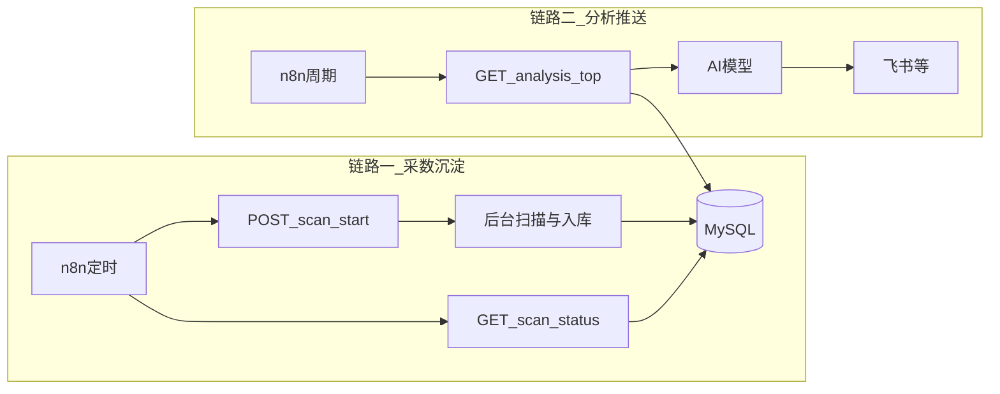

# ASO 蓝海关键词分析服务

将本地 ASO 扫描脚本服务化：FastAPI 提供 HTTP 接口、MySQL 8.0 持久化、API 密钥鉴权，支持 Docker 一键部署与 n8n 定时调用。

核心业务逻辑在仓库根目录的 **`aso_core`** 包中；本目录仅保留 HTTP 与数据库层。

## 核心业务链路

自动化场景中，本服务承担 **「采数入库」** 与 **「供数给 AI」** 两段能力；n8n 负责调度与串联下游（大模型、飞书等）。

### 链路一：n8n 定时触发检索，数据沉淀到 MySQL

1. n8n **Schedule** 到点触发。
2. 调用 **`POST /scan/start`**（带 `X-API-Key`），服务**立即**返回 `batch_id`，扫描在**后台线程**中执行（耗时可达数十分钟，勿让 n8n 单节点同步死等）。
3. 后台执行：`aso_core` 全量扫描 → 蓝海评分 → **`aso_keywords` 批量写入**，**`aso_scan_jobs`** 更新为 `done` / `failed`。
4. n8n 使用 **Wait + 轮询 `GET /scan/status/{batch_id}`**，直到 `status` 为 `done` 或 `failed`；失败时读 `error_msg` 告警。

### 链路二：n8n 周期拉取分析接口 → AI → 飞书等

1. n8n **Schedule**（建议与链路一错开，例如扫描完成后次日）。
2. 调用 **`GET /analysis/top`**（可按 `label`、`days`、`limit` 过滤），从库中读取最近一段时间内的关键词快照。
3. 将响应中的 **`keywords`**（或整段 JSON）传入 **AI 节点**（Claude / GPT 等），按业务 Prompt 生成分析报告。
4. 将 AI 输出通过 **飞书机器人 Webhook**、企业微信、邮件等节点推送给业务方。

本服务**不**内置大模型调用；**分析文案与推送渠道均在 n8n 侧配置**。



## 部署命令

构建上下文为**仓库根目录**（以便打包 `aso_core` 与 `app`）。请在 **`aso-service`** 目录下执行：

```bash
cd aso-service
cp .env.example .env
# 编辑 .env 填入密码和 API_KEY
docker compose up -d --build

# 查看启动日志
docker compose logs -f aso-service
```

依赖统一维护在仓库根目录 [`requirements.txt`](../requirements.txt)，镜像构建时从根目录复制该文件。

## 手动触发一次扫描（测试用）

```bash
curl -X POST http://localhost:8000/scan/start \
  -H "X-API-Key: 你的API_KEY" \
  -H "Content-Type: application/json" \
  -d '{"country": "us"}'
```

## 查询任务状态

```bash
curl http://localhost:8000/scan/status/{batch_id} \
  -H "X-API-Key: 你的API_KEY"
```

## 拉取分析结果

```bash
curl "http://localhost:8000/analysis/top?label=💎%20金矿&limit=20&days=7" \
  -H "X-API-Key: 你的API_KEY"
```

说明：`label` 含空格或 emoji 时请对 URL 进行编码（如上例中的 `%20`）。

## 接口调用文档

### 通用约定

| 项 | 说明 |
|----|------|
| Base URL | 内网示例 `http://aso-service:8000`；本机调试 `http://localhost:8000` |
| 鉴权 | 除 **`GET /health`** 外，均需在请求头携带 **`X-API-Key`**，值为 `.env` 中 **`API_KEY`** |
| 内容类型 | `POST /scan/start` 使用 **`Content-Type: application/json`** |
| 认证失败 | HTTP **401**，响应体示例：`{"detail":"Invalid API Key"}`（缺失密钥同样视为无效） |

### 接口一览

| 方法 | 路径 | 鉴权 | 说明 |
|------|------|------|------|
| GET | `/health` | 否 | 健康检查（Docker / 负载均衡探活） |
| POST | `/scan/start` | 是 | 异步启动全量扫描；立即返回 `batch_id` |
| GET | `/scan/status/{batch_id}` | 是 | 查询扫描任务状态与关键词条数 |
| GET | `/analysis/top` | 是 | 按时间窗口与标签从库中拉取 Top 关键词 |

**排名历史文件**：`rank_history.json` 路径由环境变量 **`RANK_HISTORY_PATH`** 指定（Compose 示例：`/data/rank_history.json`），挂载到 **`aso-data`** 卷，容器重启后不丢失。

---

### GET `/health`

用于探活，**无需** `X-API-Key`。

**响应示例（200）**

```json
{"status": "ok"}
```

---

### POST `/scan/start`

启动一次全量关键词扫描（后台执行）。

**请求头**

- `X-API-Key: <API_KEY>`
- `Content-Type: application/json`

**请求体（JSON）**

| 字段 | 类型 | 必填 | 说明 |
|------|------|------|------|
| `country` | string | 否 | 主市场区域，默认 `"us"` |

示例：

```json
{"country": "us"}
```

**响应示例（200）**

```json
{
  "batch_id": "550e8400-e29b-41d4-a716-446655440000",
  "status": "started",
  "message": "扫描任务已启动，使用 batch_id 查询进度"
}
```

---

### GET `/scan/status/{batch_id}`

根据 `batch_id` 查询任务是否结束及写入条数。

**请求头**

- `X-API-Key: <API_KEY>`

**路径参数**

- `batch_id`：`POST /scan/start` 返回的 UUID 字符串。

**响应示例（200）**

```json
{
  "batch_id": "550e8400-e29b-41d4-a716-446655440000",
  "status": "done",
  "total_keywords": 238,
  "created_at": "2026-04-10 02:00:00",
  "finished_at": "2026-04-10 02:45:00",
  "error_msg": null
}
```

`status` 取值：`running` | `done` | `failed`。失败时 `error_msg` 为非空字符串。

**错误**

- **404**：`batch_id` 不存在（响应体为 FastAPI 默认 `detail` 结构）。

---

### GET `/analysis/top`

从 MySQL 读取最近一段时间内的关键词记录，按 **`blue_ocean_score` 降序**，供 n8n 与 AI 消费。

**请求头**

- `X-API-Key: <API_KEY>`

**Query 参数**

| 参数 | 类型 | 必填 | 默认 | 说明 |
|------|------|------|------|------|
| `label` | string | 否 | — | 与库中 **`blue_ocean_label`** 精确匹配，如 `💎 金矿`、`🟢 蓝海`；含空格或符号时请 **URL 编码** |
| `limit` | int | 否 | 50 | 返回条数上限，**最大 200**（超出会被截断为 200） |
| `days` | int | 否 | 7 | 只返回最近 `days` 天内 **`scanned_at`** 落在窗口内的数据 |

**响应示例（200）**

```json
{
  "generated_at": "2026-04-10 09:00:00",
  "total": 12,
  "keywords": [
    {
      "keyword": "track medication",
      "blue_ocean_score": 85,
      "blue_ocean_label": "💎 金矿",
      "blue_ocean_flags": "多路径触发 | 头部极弱",
      "top_reviews": 320,
      "concentration": 0.21,
      "avg_update_age_months": 18.0,
      "trend_gap": 4.1,
      "rank_change": 3,
      "scanned_at": "2026-04-10 02:45:00"
    }
  ]
}
```

**说明**：`top_reviews` 等字段可能为 `null`（视入库数据而定）；n8n 下游 AI 节点请对空值做容错。

## n8n Workflow 1：定时扫描（建议每周一 02:00）

**节点1 — Schedule Trigger**

- 每周一 02:00 触发

**节点2 — HTTP Request（触发扫描）**

- Method: POST
- URL: `http://aso-service:8000/scan/start`
- Headers: `X-API-Key` → `{{$env.ASO_API_KEY}}`
- Body (JSON): `{"country": "us"}`

**节点3 — Wait**

- 等待 90 分钟（扫描预留时间）

**节点4 — HTTP Request（确认完成）**

- Method: GET
- URL: `http://aso-service:8000/scan/status/{{$node["触发扫描"].json.batch_id}}`
- Headers: `X-API-Key` → `{{$env.ASO_API_KEY}}`

## n8n Workflow 2：分析推送（建议每周二 09:00）

**节点1 — Schedule Trigger**

- 每周二 09:00 触发

**节点2 — HTTP Request（拉取蓝海数据）**

- Method: GET
- URL: `http://aso-service:8000/analysis/top?label=💎 金矿&limit=20&days=7`
- Headers: `X-API-Key` → `{{$env.ASO_API_KEY}}`

**节点3 — AI 模型节点（Claude / GPT）**

System Prompt：

```
你是一位 App Store 市场分析师，擅长从关键词数据中识别产品机会。
请用中文回答，结构清晰，重点突出。
```

User Prompt 模板：

```
以下是本周 App Store 蓝海关键词扫描结果，请完成以下分析：

1. 推荐最值得立项的3个关键词，说明理由
2. 识别这批词背后共同的用户需求模式
3. 对每个推荐词给出 MVP 核心功能（1句话）
4. 指出需要警惕的风险点

数据如下：
{{$json.keywords}}
```

**节点4 — 飞书 Webhook**

- Method: POST
- URL: 飞书机器人 Webhook 地址
- Body:

```json
{
  "msg_type": "text",
  "content": {
    "text": "📊 本周 ASO 蓝海分析报告\n\n{{$json.choices[0].message.content}}"
  }
}
```

## 本地开发（非 Docker）

在 **`aso-service`** 目录启动，将**仓库根目录**加入 `PYTHONPATH` 以加载 `aso_core`：

```bash
cd /path/to/aso_opportunities/aso-service
python -m venv .venv
source .venv/bin/activate
pip install -r ../requirements.txt
export PYTHONPATH=..
export $(grep -v '^#' .env | xargs)  # 或手动 export MySQL 等变量
uvicorn app.main:app --reload --host 0.0.0.0 --port 8000
```

需本地已安装 MySQL 8.0，并在 `.env` 中将 `MYSQL_HOST` 设为 `127.0.0.1`。

## 技术约束

- 后台任务使用 `threading.Thread(daemon=True)`，无 Celery / Redis
- 数据库访问使用 `pymysql`，无 ORM
- 采集与评分逻辑集中在仓库根目录 **`aso_core`**，与 CLI [`main.py`](../main.py) 共用实现

---

## 开发规则（维护必读）

### 分层职责

| 层级 | 路径 | 职责 |
|------|------|------|
| 核心域 | 仓库根 `aso_core/` | Apple Autocomplete / iTunes 请求、扫描流水线、蓝海评分、统一配置（`settings`） |
| 服务适配层 | `aso-service/app/` | FastAPI 路由、**`X-API-Key` 鉴权**、MySQL 建表与读写、后台线程触发扫描 |

### 修改指引

- **改蓝海评分规则、标签阈值**：只改 **`aso_core/scorer.py`**。改完后 CLI 与 Docker 服务行为一致。
- **改补全或 iTunes 请求、机会分公式**：改 **`aso_core/autocomplete.py`**、**`aso_core/competition.py`**。
- **改扫描流程（种子、去重、trend_gap、rank 历史文件）**：改 **`aso_core/scanner.py`**。
- **改默认国家、限流间隔、排名历史路径等**：改 **`aso_core/settings.py`** 或环境变量 / `.env` / `config.json`（见该文件注释）。
- **仅当产品明确要求变更 HTTP 契约时**：才改 **`aso-service/app/main.py`**（路由路径、请求体字段名、JSON 响应字段名）。

### n8n 与接口契约（强约束）

1. **勿随意改名**：`POST /scan/start`、`GET /scan/status/{batch_id}`、`GET /analysis/top` 的路径及现有 JSON 字段名被 n8n 工作流硬编码引用；变更视为 **破坏性更新**，需同步改 n8n 并发版说明。
2. **长任务必须异步**：扫描耗时长，**必须**「`start` 拿 `batch_id` + 轮询 `status`」，不要让 n8n 单次 HTTP 请求同步等待扫描结束，以免超时。
3. **密钥不入库**：`API_KEY` 仅放在 n8n 环境变量或凭据中，不要写进工作流 JSON 明文（若导出备份需脱敏）。

---

## 给 AI 助手 / Copilot 的维护 Prompt（可粘贴使用）

将下面整段复制到后续对话中，便于 AI 在**不破坏 n8n 集成**的前提下改代码：

```text
你正在维护仓库中的 ASO 蓝海关键词项目，其中 HTTP 服务位于 aso-service/，核心业务在仓库根的 aso_core/。

必须遵守：
1. 业务逻辑（Apple API、扫描流程、蓝海评分、配置读取）只允许在 aso_core/ 内修改；aso-service/app/ 只做鉴权、路由、MySQL 与线程调度。
2. 除非用户明确要求「破坏性变更」，否则保持以下 API 不变：POST /scan/start、GET /scan/status/{batch_id}、GET /analysis/top、GET /health；响应 JSON 的字段名与含义与 README 一致。
3. 扫描是长时间后台任务：POST /scan/start 只返回 batch_id，不得改为同步阻塞至扫描结束。
4. 不要引入任务队列（Celery/Redis）除非用户明确要求；当前架构为 threading + MySQL。
5. 修改数据库表结构时同步更新 app/database.py 中的 init_db 与读写 SQL，并考虑已有 n8n 只读 analysis 接口的兼容性。
6. 依赖以仓库根 requirements.txt 为准；Docker 构建上下文为仓库根（docker-compose 中 context: ..）。

当前业务链路简述：
- 链路一：n8n 定时 POST /scan/start → 轮询 GET /scan/status → 数据进 MySQL。
- 链路二：n8n 定时 GET /analysis/top → 把 keywords 交给大模型 → 飞书等 Webhook 推送。
```

---

## 与核心链路的对应关系

| README 章节 | 链路一（采数） | 链路二（分析推送） |
|-------------|----------------|-------------------|
| n8n Workflow 1 | 是 | 否 |
| n8n Workflow 2 | 否 | 是 |
| 接口调用文档 | `POST /scan/start`、`GET /scan/status` | `GET /analysis/top` |