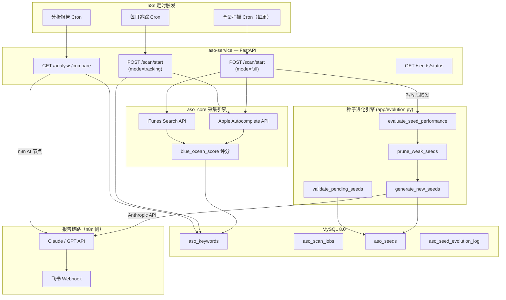
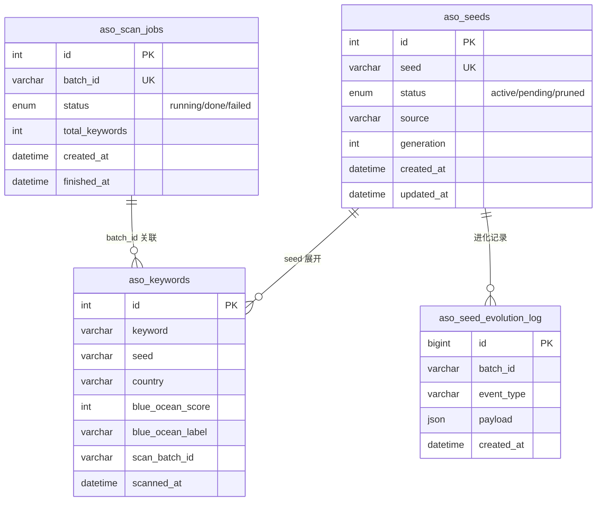

# 架构说明

## 系统总览

ASO Keyword Engine 由以下组件构成：

| 组件 | 职责 |
|------|------|
| **aso_core/** | 纯采集/评分引擎：Apple Autocomplete、iTunes Search、蓝海评分 |
| **app/** | FastAPI 服务层：路由、MySQL 持久化、种子进化 |
| **n8n** | 外部编排：定时触发扫描、拉取分析数据、AI 生成报告、推送飞书 |
| **MySQL 8.0** | 关键词、扫描任务、种子矩阵、进化日志持久化 |
| **Claude API** | 服务内种子进化（Anthropic），n8n 中报告生成（用户自配） |

## 业务流程图

## 全量扫描流程（mode=full）

1. n8n 定时触发 `POST /scan/start`（`mode=full`）
2. 服务从 `aso_seeds` 表读取 `status=active` 的种子
3. 对每个种子 × 每个国家（`ASO_SCAN_COUNTRIES`）调用 Apple Autocomplete API 展开关键词
4. 对每个关键词调用 iTunes Search API 获取竞争数据（评论数、更新时间、集中度）
5. 计算 `seed_coverage`、`trend_gap`、`rank_change` 等指标
6. `blue_ocean_score()` 综合评分并写入 `aso_keywords` 表
7. 触发进化流水线：
   - `evaluate_seed_performance()` — 聚合各种子表现
   - `prune_weak_seeds()` — 淘汰低效种子
   - `generate_new_seeds()` — 调用 Claude API 推断新种子（写入 `pending`）
   - `validate_pending_seeds()` — 对 pending 种子做 autocomplete 校验，通过则激活

## 每日追踪流程（mode=tracking）

1. n8n 定时触发 `POST /scan/start`（`mode=tracking`）
2. 从 `aso_keywords` 中查近 30 天内 `blue_ocean_score >= 60` 的 active 种子
3. 仅对这些种子重新扫描更新排名
4. 写库，**不触发**进化流程

## 分析报告流程

1. n8n 定时触发 `GET /analysis/compare`
2. MySQL 用 `ROW_NUMBER()` + `LAG()` 窗口函数计算本期与基线窗口的 `score_delta`
3. 返回 `rising` / `new_entries` / `sustained` / `dropping` 四类数据
4. n8n AI 节点（Claude/GPT）生成自然语言报告
5. 推送到飞书 Webhook

## 数据表关系

